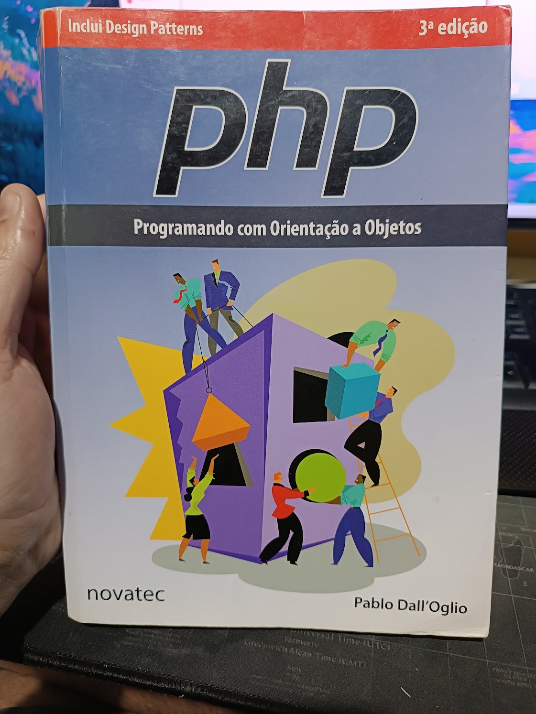

# 📘 Estudo: PHP com Orientação a Objetos

Este repositório foi criado com o objetivo de registrar meus estudos sobre PHP, utilizando como base o livro **"PHP - Programando com Orientação a Objetos (3ª Edição)", de Pablo Dall’Oglio**.

Esta sugestão foi dada por um dos meus mentores: [Marcelgsantos](https://www.linkedin.com/in/marcelgsantos/)

---

## 🎯 Objetivo

Conhecer melhor os fundamentos da linguagem PHP moderna, com foco em conceitos de orientação a objetos, boas práticas e padrões de projeto.

Este estudo será utilizado tanto para reforço da teoria quanto para aplicação prática em projetos PHP.

O livro foi lançado faz um tempo, mas ao longo do tempo, irei atualizar conforme me deparar com dúvidas no dia a dia. Mas a essência do PHP está presente.

Pularei algumas partes que considero já internalizadas

---

## 🧠 Método de Estudo

Minha abordagem segue uma estrutura simples e eficaz:

1. **Leitura seletiva** dos tópicos mais relevantes do livro  
2. **Criação de exemplos práticos** em arquivos `.php`  
3. **Uso de flashcards (Anki)** internalizar os conceitos, sendo que o Anki aplicado de forma correta, fornece: Active Recall + Repetição espaçada + Prática deliberada (Farei explicação mais detalhada (no futuro) sobre este método de estudos).

--- 

## 💫 Sobre ANKI


1. O Anki por si só é muito bom para internalizar: conceitos, fatos, funções e **"partes"**, mas é sempre necessário desenvolver projetos para **"grudar"** todo o conteúdo.
2. Ao usar Anki, você fica muito bom em responder o Anki, mas não significa que em 100% dos casos, conseguirá lembrar exatamente um conceito/fato. Mas sua retenção aumenta bastante.
3. Ao estudar/revisar os flashcards, é interessante ue seja feito pelo computador, com um editor de texto pra tentar escrever respostas que sejam em código.
4. O cérebro esquece o que não usa, se não revisar, irá esquecer.


---

## 🧩 Exemplo de Flashcard

**P:** Como criar um método construtor em PHP?

**R:**
```php
public function __construct($nome) {
    $this->nome = $nome;
}
```

---

## 🧱 Estrutura do Livro

O livro é dividido em 7 capítulos principais, com foco crescente em orientação a objetos e padrões de projeto:

| Capítulo | Tema |
|----------|------|
| 1 | Introdução ao PHP |
| 2 | Fundamentos de Orientação a Objetos |
| 3 | Tópicos Especiais em OO |
| 4 | Persistência com PDO e padrões |
| 5 | Apresentação e Controle (MVC, componentes) |
| 6 | Formulários e Listagens |
| 7 | Criação de uma aplicação completa |

---

